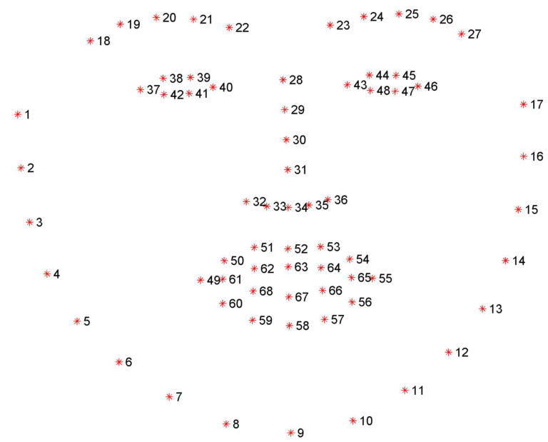
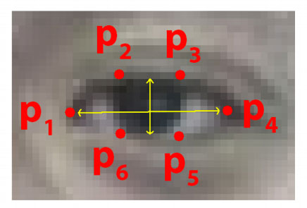
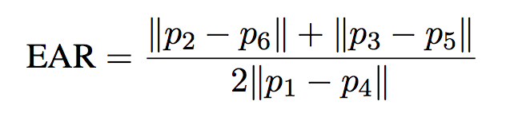
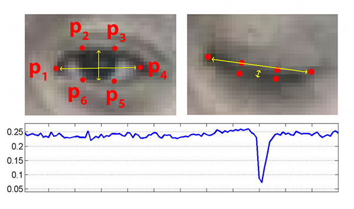
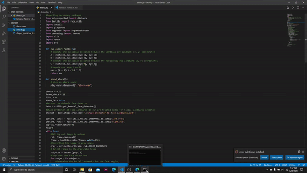

# Drowsiness Detection Alert System

 > Drowsiness is the biggest problem for road accidents.
       
## Description  
```This is a computer-vision system which detect drowsiness in real-time and plays an alarm when someone appears to be drowsy.```

## Application
 - Transporation where almost daily accidents occur due to driver fatigue.

## Code Requirements
 - Python (version greater than 2.7)
 
 ### Import dependencies
  - opencv(cv2)
  - dlib
  - imutils
  - scipy
  - playsound

## Algorithm
<p align="center">
  
</p>
Here, pre-trained facial landmarks model is used in which we extract the 6 (x, y)- coordinates of detected eye and then find eye aspect ratio(EAR).

### Eye Aspect Ratio (EAR)
<p align="center">
  
  
</p>

It checks for 20 consecutive frames and if the EAR gets below 0.25, we set the alarm ON.
<p align="center">
  
</p>
## Samples

<p align="center">
  
 
</p>
